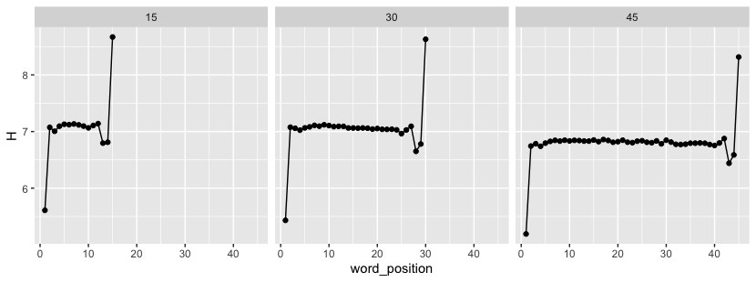

```{r load-packages, include = FALSE}
library(xtable)
library(knitr)
library(papaja)
library(ggthemes)
library(lmerTest)
library(directlabels)
library(ggrepel)
library(feather)
library(here)
library(tidyboot)
library(broom)
library(broom.mixed)
library(ggdendro)
library(gridExtra)
library(ggpmisc)

library(tidyverse)


theme_set(theme_classic(base_size = 14) + theme(legend.position = "none"))

knitr::opts_chunk$set(fig.pos = 'tb', echo = FALSE, warning = FALSE, 
                      cache = TRUE, warning = FALSE, message = FALSE, 
                      sanitize = TRUE, fig.path='figs/', fig.width = 3,
                      fig.height = 3)
set.seed(42)
options(digits=2)
```


```{r load-data, include = F}
# childes_results <- read_csv(here("Data/Paper/childes_results.csv"))
# bnc_results <- read_csv(here("Data/Paper/all_bnc_results.csv"))
# wiki_results <- read_feather(here("Data/Paper/all_spaces.feather"))
# wiki_curves <- read_csv(here("Data/Paper/relative_ngrams.csv"))
# wiki_lr <- read_feather(here("Data/Paper/models.feather"))


lengths <- read_csv(here("Data/Paper/lengths.csv"))

bnc <- read_csv(here("Data/length_counts.csv"))

b <- read_csv(here("Data/5barycenters.csv"),
              col_names = c("1", "2", "3", "4", "5",
                            "language", "source", "gram")) %>%
  filter(source == "wikipedia")
  

tidy_b <- b %>%
     pivot_longer(-c(language, source, gram), 
                  names_to = "position", values_to = "surprisal") %>%
     mutate(position = as.numeric(position),
            gram = factor(gram, levels = c("unigram", "trigram")))


non_wiki_b <- read_csv(here("Data/5barycenters.csv"),
              col_names = c("1", "2", "3", "4", "5",
                            "language", "source", "gram")) %>%
  filter(source != "wikipedia")

tidy_non_wiki_b <- non_wiki_b %>%
     pivot_longer(-c(language, source, gram), 
                  names_to = "position", values_to = "surprisal") %>%
     mutate(position = as.numeric(position),
            gram = factor(gram, levels = c("unigram", "trigram")))


wals <- read_csv(here("Data/Paper/wals_distances.csv"))
wals_types <- read_csv(here("Data/Paper/wals_type_distances.csv"))
swadesh <- read_csv(here("Data/Paper/swadesh_distances.csv"))
cosines <- read_csv(here("Data/Paper/cosines.csv")) 

bnc_surprisals <- read_csv(here("Data/Paper/bnc_subset.csv")) %>%
    mutate(gram = factor(gram, levels = c("unigram", "trigram")))

```

# Introduction

One of the defining features of human language is its power to transmit information. We use language for a variety of purposes like greeting friends, making records, and signaling group identity. These purposes all share a common goal: Transmitting information that changes the mental state of our listener [@austin1975]. For this reason, we can describe language as a cryptographic code, one that allows speakers to turn their intended meaning into a message that can be transmitted to a listener, and subsequently converted by the listener back into an approximation of the intended meaning [@shannon1948]. 

How should we expect this code to be structured? If language has evolved as a code for information transmission, its structure should reflect this process of optimization [@anderson1989]. The optimal code would have to work with two competing pressures: (1) For listeners to easily and successfully decode messages sent by the speaker, and (2) For speakers to easily code their messages and transmit them to a listener with minimal effort and error. A fundamental constraint on both of these processes is the linear order of spoken language--sounds are produced one at a time and each is unavailable perceptually once it is no longer being produced. 

Humans accommodate this linear order constraint through incremental processing: People process speech continuously as it arrives, predicting upcoming words and building expectations about the meaning of an utterance in real time rather than at its conclusion [@kutas2011; @tanenhaus1995; @pickering2013]. This solution creates new guidance for speakers. Since prediction errors can lead to severe processing costs and difficulty integrating new information on the part of listeners, speakers should seek to minimize prediction errors. However, the cost of producing more predictable utterances is using more words. Thus, the most efficient strategy is for speakers seeking to minimize their production costs is to produce utterances that are just at the prediction capacity of listeners without exceeding this capacity [@aylett2004; @genzel2002]. In other words, speakers should maintain a constant transmission of information, with the optimal rate of information transfer as close to the listener's fastest decoding rate as possible. The hypothesis that speakers follow this optimal strategy is known as the *Uniform Information Density* hypothesis. 

Using information theory, a mathematical framework for formalizing predictability, researchers have tested and confirmed this optimal coding prediction across several levels and contexts in language production. For example, @genzel2002 provided a clever indirect test of Uniform Information Density  across sentences in a paragraph. They showed that the predictability of successive sentences, when analyzed in isolation, decreases, as would be expected if readers use prior sentences to predict the content of future sentences. Thus, based on the increasing amount of context, they found that total predictability remains constant. At the level of individual words, @mahowald2013 showed that speakers use shorter alternatives of more predictable words, maximizing the amount of information in each word while minimizing the time spent on those words.  

Other research has suggested that efficient encoding impacts how speakers structure units between words and sentences. The inclusion of complementizers in relative clauses [@jaeger2007] and the use of contractions [@frank2008] are two situations in sentence formation in which speakers can omit or reduce words to communicate more efficiently and maximize use of the communication channel without exceeding the listener's capacity. 

How languages evolve is shaped by efficient communication as well. @piantadosi2011 showed that more easily predictable words in a language may tend to become shorter over time, maximizing the amount of information transmitted over the communication channel at every second by speakers in each language. Semantic categories of words across languages can also evolve to be structured efficiently. Categories such as kinship terms [@kemp2012kinship] maintain a trade-off between informativeness and complexity. Structure in langauge evolves from a trade-off between efficient and learnable encoding on the one hand and an expressive and descriptive lexicon on the other [@kirby2015compression]. Languages may come to efficiently describe the particular environment in which they are spoken over the course of evolution: features of the world that are relevant to speakers become part of a language, while irrelevant features are disregarded [@perfors2014language]. 

However, despite this literature using the predictive coding model of language, one level has not yet been studied in depth: how speakers structure each individual utterances. This level may show the strongest effects of variation between languages. While speakers can make bottom-up choices such as controlling which of several near-synonyms they produce, they cannot control the grammatical properties of their language. Properties of a language, like canonical word order, impose top-down constraints on how speakers can structure what they say. While speakers may produce utterances as uniform in information density as their languages will allow, these top-down constraints may create significant and unique variation across languages. 

How significant are a language's top-down constraints on determining how its speakers structure their speech? @yu2016 analyzed how the information in words of English sentences of a fixed length varies with their order in the sentence (e.g. first word, second word, etc). They found a surprising non-linear shape, and argued that this shape may arise from top-down grammatical constraints in the English language. We build on these ideas, asking (1) Whether this shape depends on listener's predictive models, (2) Whether this shape varies across linguistic contexts, and (3) Whether this shape is broadly characteristic of a diverse set of languages or varies predictably from language to language. We find that languages are characterized by highly-reliable but cross-linguistically variable information structures that co-vary with top-down linguistic features. Listeners' predictive coding flattens these shapes across languages, in accord with predictions of the Uniform Information Density hypothesis.

# Methods

We measure information structure within languages, using a universal information metric proposed for the study of information transmission more generally by @shannon1948 and applied to words specifically by @levy2008: lexical surprisal. We can compute surprisal with the predictability of the word based on previously heard or seen words in its context, as in the formula below. The surprisal of a word is inversely proportional to the predictability of a word, such that less common and less predictable words carry more information. For example, “flower” has less information than “azalea” because “flower” is much more common than “azalea”. Though the two words have the same length in number of letters, it is more difficult to process “azalea” when reading it here than when reading “flower”. Frequency is intimately tied information content in words, with much of the differences between words frequencies being explained by information content cross-linguistically [@piantadosi2011]. The surprisal of a word is also correlated with the processing cost of a word, shown by evidence from e.g. eye-tracking [@smith2013] and ERP [@frank2015] studies.

However, when reading or listening, people don’t just consider each word as an isolated linguistic signal. Listeners use the words they have already heard to predict and decode the word they are currently hearing. Following this incremental processing paradigm, we can also condition the surprisal of a word in its context. Ideally, we would like to measure the predictability of each word in an utterance using all of the information available to that word. For example, in an utterance of twenty words, we would like to use the previous $19$ words of context to predict the $20$th word. However, we would need to train on a corpus of many trillion word tokens to predict with this amount of context. Regardless of computational constraints, we want to directly compare how predictable each word is regardless of its position in an utterance. 

We therefore use a simplifying *Markov assumption*: we condition our next predictions on a fixed-size context window instead of all preceding words. Although these models may seem to use an inconsequential amount of context when predicting the next word, bigram and trigram models introduce a great deal of improvement over unigram models across tasks [@chen1999]. Models which incorporate more than two words of context have issues with overfitting to the corpus and only predicting observed sequences, often generalizing poorly. 

When we use a word or two of context in our surprisal calculations, then the set of reasonable final items in our ngrams is greatly restricted. “Flower” may contain less information than “azalea” when we consider the words independently of their context, but with context this can be reversed. Flower appears in a variety of contexts, and so the information content of a word like “flower” in a particular context may be higher than “azalea”. If you only have azaleas in your garden, then hearing someone say “in that garden, look at the flowers” may be higher surprisal for you: you expect them to say “azalea”. This prediction does not require many words for context. For example, in the sentence “I take my coffee with cream and sugar”, when hearing “cream and”, a listener might automatically predict “sugar”, but there are few possible continuations with even the two words "cream and". Hearing “I” restricts the next word to a verb, or possibly an adverb, and since the listener has heard the speaker refer to themselves in the first person singular, their set of possible completions is significantly restricted. 

We train two types of ngram language models independently on a corpus. One of our models is frequency-based: we do not incorporate context into our surprisal calculations. To incorporate context into our models, we train bigram and trigram language models, which incorporate one and two words of context for each processed word, respectively. The frequency-based surprisal metric gives us an idea of when in their utterances speakers say frequent i.e. independently information-rich words. The context-based surprisal metric show us how speakers tend to distribute the information in utterances relative to real-time processing in communication. We expect a priori that our frequency-based surprisal curve will be flat. No one part of the sentence will on average have words that are more frequent than another across utterance lengths. Similarly, we expect that there will be a small smoothing effect for our contextual surprisal metric such that the word in each position of an utterance is more predictable than its frequency-based counterpart.

## Estimating information

To estimate how information is distributed across utterances, we computed the lexical surprisal of each word under two different models. First, following @yu2016, we estimated a unigram model which considers each word independently:

$$\text{surprisal}(\text{word}) = -\log P(\text{word})$$ 

This unigram surprisal measure is a direct transformation of the word's frequency and thus less frequent words are more surprising. Simply the less often a person has seen a word, the more information that word holds. 

Second, we estimated a trigram model in which the surprisal of a given word ($w_i$) encodes how unexpected it is to read it after reading the prior two words ($w_{i-1}$ and $w_{i-2}$):

$$\text{surprisal}(w_{i}) = -log P(w_i|w_{i-1},w_{i-2})$$ 

This metric encodes the idea that words that are low frequency in isolation (e.g. "meatballs") may become much less surprising in certain contexts (e.g. "spaghetti and meatballs") but more surprising in others (e.g. "coffee with meatballs"). The difficulty of correctly estimating these probabilities from a corpus grows combinatorically with the number of prior words, and in practice trigram models perform well as an approximation [see e.g. @chen1999; @smith2013].

### Model details

We estimated the surprisal for each word type in a corpus using the KenLM toolkit [@heafield2013]. Each utterance was padded with a special start-of-sentence token "$\left<s\right>$" and end of sentence token "$\left</s\right>$". Trigram estimates did not cross sentence boundaries, so for example the surprisal of the second word in an utterances was estimated as $\text{surprisal}(w_{2}) = -P(w_2|w_{i},\left<s\right>)$. Naïve trigram models will underestimate the surprisal of words in low-frequency trigrams (e.g. if the word "meatballs" appears only once in the corpus following exactly the words "spaghetti and", it is perfectly predictable from its prior two words). 

To avoid this underestimation, we used modified Kneser-Ney smoothing as implemented in the KenLM toolkit [@heafield2013]. Briefly, this smoothing technique discounts all ngram frequency counts, which reduces the impact of rare ngrams on probability calculations, and interpolates lower-order ngrams into the calcuations. These lower-order ngrams are weighted according to the number of distinct contexts they occur as a continuation (e.g. "Francisco" may be a common word in a corpus, but likely only occurs after "San" as in "San Francisco", so it receives a lower weighting). For a thorough explanation of modified Kneser-Ney smoothing, see @chen1999.  

### Aggregating curves

To develop a characteristic information curve for sentences in the corpus, we needed to aggregate sentences that varied dramatically in length (Fig \ref{bnc-plots}A). We used Dynamic Time Warping Barycenter Averaging (DBA), an algorithm for finding the average of sequences that share and underlying pattern but vary in length [@petitjean2011]. DBA inverts standard dynamic time warping, discovering a latent invariant template from a set of sequences. 

We used DBA to discover the short sequence of surprisal values that characterized the surprisal curves common to sentences of varying sentence lengths. We first averaged individual sentences of the same length together and then applied the DBA algorithm to this set of average sequences. DBA requires a parameter specifying the length of the template sequence. 

### Optimizing the size hyperparameter for barycenter averaging

```{r plotting-barycenters, echo=F, fig.align="center", fig.cap="The final cost for the EM algorithm in fitting each size of barycenter"}
em_costs <- read_csv(here("Analysis/EM/em_costs.csv"))

# non-parametric bootstrap and
em_boot <- em_costs %>%
  group_by(size, gram) %>%
  tidyboot_mean(final_cost, na.rm = TRUE) %>%
  ungroup() 

em_boot %>%
  ggplot(aes(x = size, y = empirical_mean, ymin = ci_lower, ymax = ci_upper,
             color = gram)) + 
    geom_pointrange(position = position_dodge(.25)) + 
    geom_line() + 
  scale_x_continuous(breaks = seq(1,15,1)) +
  theme(legend.position = "bottom")

barycenter_size <- 10
```

We give the intuition for how we chose size X. How we find the barycenter produces a cost: the further the barycenter is from each data point, the higher the cost. We tried every size of barycenter in between 4 and 15 coordinates and found that `r barycenter_size` afforded the smallest size of the barycenter with the lowest cost. 

<!-- 1. how deal with different grams? 2. many possible solutions -> use marginal cost? 3. pretty large confidence intervals across languages. use approach other than the mean? -->

We use the implementation of DBA in the Python package tslearn [@tslearn], which fits the barycenter to a time-series dataset through the expectation-maximization algorithm [EM; @moon1996]. DBA in this implementation allows us to specify the size of the barycenter. In order to choose the optimal size for the barycenters, we computed the final cost from the EM algorithm for each barycenter size and chose the barycenter size which minimized the average final cost. Time costs were negligible for computing a larger barycenter. 

### Application to the corpus

Once we have fitted our language model, we can compute the surprisal of a continuation by simply taking the negative log-probability of that word's ngram probability. To find the average information for a given position in a corpus, we take all utterances of a given length, and for each word position in utterances of that length, we compute the average of the surprisals for all of the non-unique words that occur in that position, conditioned or not conditioned on context. By computing these averages for each word position in an utterance, we compute a low-dimensional approximation to the average distribution of information in the corpus. With the surprisal metric, we base the information contained in each word on how often the word is encountered in its context in the corpus. As long as the corpus is representative of the language or population we study, then the distribution of information is approximated for that language or population as a whole. 

# Study 1: The Shape of Information in Written English

@genzel2002 performed an influential early test of the Uniform Information Density hypothesis and found a specific information curve shape in English that serves as a prior on our analyses here. They analyzed the amount of information in successive sentences in the Penn Treebank corpus [@marcus1993], and found that the amount of information increased across sentences when each was considered in isolation. They reasoned that since all prior sentences provide the context for reading each new sentences, the amount of total information that the reader decoded within each sentence was constant overall. 

@genzel2002 used a conditional probability model given by the formula below, in which the probability of a sentence is given by the unigram probability of the first word, the conditional probability of the second word given the first, and the probability of the third word given the first two words, followed by a four-gram model in which each successive word for the rest of the sentence is predicted based on the three words which precede it. @genzel2002 then log-scaled the probability of the sentence, giving the cross-entropy between the model and the true word distribution. 

$$P(S) = P(w_1) P(w_2 | w_1) P(w_3 | w_2, w_1) \cdot \prod\limits_{i=1}^n P(w_n | w_{n-3} w_{n-2}, w_{n-1})$$

The roughly linear and monotonic function they found, shown in Fig \ref{fig:genzel}, serves as a prior on our results. UID would predict a result similar to Genzel and Charniak's [-@genzel2002] results: a smooth and monotonically increasing linear function of word position. Why this shape? Later sentences have context from previous sentences, building readers intuitions about which words will come next and increasing predictive power. In this environment, speakers can produce increasingly informative utterances, relying on their listeners' predictive processing to interpret more information words. 

<!-- Make direct replication of the Genzel and Charniak results  -->

```{r genzel, echo = F, fig.cap = "The results from the Genzel and Charniak paper", eval = FALSE}
knitr::include_graphics("figs/genzel-plot.png")
```

@yu2016 applied this same logic to each word within sentences, computing the entropy over each successive word position in an utterance. The entropy metric @yu2016 used is the average surprisal of all the words in a given word position, computed only within that position, and weighted by how many times each word occurs in that position. Their formula is given by $\text{H}(X) = -\sum_{w}P(w \in X) \log P(w)$, where $X$ is a word position (e.g. first words, fifth words, final words) and $w$ is a word occuring in position $X$. 

The first word of each sentence tended to contain little information, while words in the middle of sentences each contained roughly the same amount of information as one another, and the final word of each sentence contained much more information than any other word. They found the same distribution across sentence lengths, from sentences with $15$ words to sentences with $45$ words. 

@yu2016 interpreted their uneven information curve as evidence against the Uniform Information Density Hypothesis as, unlike Genzel and Charniak's [-@genzel2002] results, information plateaued in the middle of sentences. See Fig \ref{fig:bnc-yu}. 

<!-- Make direct replication of the Yu et al results -->

```{r bnc-yu, echo=FALSE, fig.cap="A caption", out.width = '100%'}

```

There are several disadvantages to the @yu metric. First, although it is faster and less intensive to compute, it does not produce a model and instead consists of summary statistics on a single corpus. Second, these statistics cannot be compared across corpora, due to the entropy metric being extremely sensitive to the size of the corpus. Third, the entropy metric is difficult to interpret. Each measure based on sentence position depends on the length of the sentence in number of words, and speakers do not choose their utterance length as a hyperparameter before beginning production. Finally, the metric makes a naive independence assumption on the words in each sentence position. The final word does depend to some extent on each word that came before it. Although @genzel2002 made a similar simplifying Markov assumption, their model is able to capture local dependencies between words in production. 

We replicate the analysis from @yu2016 here, and build an additional model to bring their analysis more in line with Genzel and Charniak's [-@genzel2002] methods. Finally, we also develop a method for averaging the curves for sentences of different lengths together to provide a single typical information structure.

## Data

Following @yu2016, we selected the British National Corpus (BNC) for analysis [@leech1992]. The BNC is an approximately 100 million word corpus consisting of mainly of written (90%) with some spoken transcriptions (10%) of English collected by researchers at Oxford University in the 1980s and 1990s. The BNC is intended to be representative of British English at the end of the 20th century, and contains a wide variety of genres (e.g. newspaper articles, pamphlets, fiction novels, academic papers). @yu2016 only used the written portion of the BNC, although we include the much smaller spoken portion as well. 

## Pre-processing

```{r bnc-setup}
MIN <- 5
MAX <- 45

bnc_total <- lengths %>%
    filter(language == "bnc") %>%
    pull(n) %>%
    sum()

bnc_kept <- lengths %>% 
    filter(length >= MIN, length <= MAX) %>% 
    summarise(n = sum(n)) %>%
    mutate(n = (n/bnc_total) * 100) %>%
    pull(n) %>%
    round(2)
    
```

We began with the XML version of the corpus, and used the \texttt{justTheWords.xsl} script provided along with the corpus to produce a text file with one sentence of the corpus on each line. Compound words (like "can't") were combined, and all words were converted to lowercase before analysis. This produced a corpus of just over six million utterance of varying lengths. From these, we excluded utterances that were too short to allow for reasonable estimation of information shape (fewer than `r MIN` words), and utterances that were unusually long (more than `r MAX` words). This exclusion left us with `r bnc_kept`% of the utterances (Fig \ref{fig:bnc-lengths}).

Due to the size of the corpus, we do not include it along with our submission, but we include the scripts and directions in the copy of our GitHub repository. 

```{r bnc-lengths, echo = F, fig.height = 1.75, fig.align = "center", fig.cap="The distribution of sentence lengths in the British National Corpus. We analyzed sentences of length 5-45 (colored)."}

# raw length distribution
lengths %>%
    filter(language == "bnc", length <= 100) %>%
    mutate(group = if_else(length < MIN | length > MAX, "out", "in")) %>%
    ggplot(aes(x = length, y = n, fill = group, color = group)) +
    geom_col() +
    labs(x = "sentence length", y = "frequency") +
    theme(legend.position = "none", aspect.ratio = 1/1.33) + 
    scale_fill_manual(values = c(ptol_pal()(1), "light gray")) +
    scale_color_manual(values = c(ptol_pal()(1), "light gray"))

```

## Results and Discussion

```{r bnc-raw-full, eval = F}
bnc_unigram_surprisals <- read_csv(here("Surprisals/adult/unigram/bnc.csv"))

bnc_subset_unigram <- bnc_unigram_surprisals %>%
    filter(length %in% c(15, 30, 45)) %>%
    mutate(new_sent = !(position > lag(position)), 
           new_sent = if_else(is.na(new_sent), 0, as.numeric(new_sent)),
           sentence = cumsum(new_sent)) %>%
    group_by(length, position) %>%
    summarise(mean = mean(surprisal), sem = sd(surprisal)/sqrt(n()-1)) %>%
    mutate(gram = "unigram")

bnc_subset_trigram <- bnc_trigram_surprisals %>%
    filter(length %in% c(15, 30, 45)) %>%
    mutate(new_sent = !(position > lag(position)), 
           new_sent = if_else(is.na(new_sent), 0, as.numeric(new_sent)),
           sentence = cumsum(new_sent)) %>%
    group_by(length, position) %>%
    summarise(mean = mean(surprisal), sem = sd(surprisal)/sqrt(n()-1)) %>%
    mutate(gram = "trigram")

write_csv(bind_rows(bnc_subset_unigram, bnc_subset_trigram),
          here("Data/Paper/bnc_subset.csv"))

```

```{r bncplots, fig.height = 3.5, fig.pos = "tb", fig.align = "center", fig.cap = "(A) Surprisal by sentence position of length 15, 30, and 45 sentences in the British National Corpus under unigram and trigram surprisal models. Error bars indicate 95\\% confidence intervals (tiny due to sample size). (B) Characteristic information curves produced by the DBA algorithm averaging over all sentence lengths in each corpus. "}
bnc_annotations <- tibble(position = c(12, 27, 42),
                          length = c(15, 30, 45),
                          gram = c("unigram", "unigram", "unigram"),
                          mean= c(4, 4, 4))

bnc_plot1 <- ggplot(bnc_surprisals, aes(x = position, y = mean, color = as.factor(length),
                           linetype = gram, label = length)) + 
    geom_errorbar(aes(ymin = mean - 1.96 * sem, ymax = mean + 1.96 * sem), width = 0) + 
    geom_line(position = position_dodge(.5)) + 
    scale_color_ptol() + 
    scale_linetype_manual(values = c("solid", "longdash")) + 
    geom_text(data = bnc_annotations) + 
    annotate("text", x = 6.5, y = 3.5, label = "Unigram") + 
    annotate("text", x = 6.5, y = 2.5, label = "Trigram") + 
    labs(x = "Sentence position", y = "Surprisal") + 
    labs(tag = "A") + 
    theme_few() +
    theme(legend.position = "none", aspect.ratio = 1/1.33)


bnc_b_annotations <- tibble(position = c(2.5, 2.5),
                          gram = c("unigram","trigram"),
                          surprisal = c(3.5, 2))

bnc_plot2 <- tidy_non_wiki_b %>% 
    filter(gram %in% c("unigram", "trigram"), language %in% c("bnc")) %>% 
    ggplot(aes(x = position, y = surprisal, color = gram)) + 
    geom_point(size = .75) + 
    geom_line() + 
    geom_text(aes(label = gram), data = bnc_b_annotations) +
    scale_x_continuous(breaks = 1:5) + 
    xlab("Coordinate") + 
    ylab("Surprisal") + 
    scale_color_colorblind() + 
    labs(tag = "B") + 
    theme_few() +
    theme(aspect.ratio = 1/1.33, legend.position = "none")

gridExtra::grid.arrange(bnc_plot1, bnc_plot2, ncol = 1)
```

We began by replicating Yu et al.'s [-@yu2016] analyses, examining the surprisal of words in sentence of length 15, 30, and 45 estimated by our unigram model. In line with their computations, we found a reliably non-linear shape in sentences of all 3 lengths, with the information in each word rising for the first two words, plateauing in the middle of sentences, dipping in pen-ultimate position, and rising steeply on the final word (Fig. \ref{fig:bncplots}A). Qualitatively, we found the same shape in utterances of all other lengths we sampled, from utterances with 5 words to utterances with 44 words. 

In comparison, under the trigram model we observed 3 major changes. First, each word contained significantly less information. This is to be expected as the knowing two prior words makes it much easier to predict the next word. Second, the fall and peak at the ends of utterances was still observable, but much less pronounced. Finally, the first word of each sentence was now much more surprising than the rest of the words in the sentence, because the model had only the start of sentence token $\left<s\right>$ to use as context. Thus, the trigram model likely overestimates the information for humans reading the first word. Together, these results suggest that @yu2016 overestimated the non-uniformity of information in sentences. Nonetheless, the final words of utterances do consistently contain more information than the other words.

Fig. \ref{fig:bncplots}B shows the barycenters produced by the dynamic time warping barycenter averaging algorithm. The algorithm correctly recovers both the initial and final rise in information under the unigram model, and the initial fall and smaller final rise in the trigram model. We take this as evidence that (1) these shapes are characteristic of all lengths, and (2) that DBA effectively recovers characteristic information structure. 

In sum, the results of Study 1 suggest that sentences of written English have a characteristic non-uniform information structure, with information rising at the ends of sentences. This structure is more pronounced when each word is considered in isolation, but some of the structure remains even when each word is considered in context. 

Is this structure unique to written English, or does it characterize spoken English as well? In Study 2, we apply this same analysis to two corpora of spoken English--the first of adults speaking to other adults, and the second of adults and children speaking to each other.

```{r spoken-figs, fig.env = "figure*", fig.pos = "tb", fig.height = 3.5, fig.width = 7, fig.align = "center", set.cap.width=T, num.cols.cap=2, fig.cap = "(A) The distribution of sentence lengths in the spoken English corpora: Adults in Santa Barbara, and parents and children in CHILDES. We analyzed sentences of length 5-15 (colored). (B) Charateristic surprisal curves for these corpora."}
SPOKEN_MIN <- 5
SPOKEN_MAX <- 15

# raw length distribution
spoken_plot1 <- lengths %>%
    filter(language != "bnc", length <= 40) %>%
    mutate(corpus = case_when(language == "sbc" ~ "adults",
                              source == "adult" ~ "parents",
                              T ~ "children"),
           corpus = factor(corpus, levels = c("adults", "parents",
                                              "children")),
           group = if_else(length < SPOKEN_MIN | length > SPOKEN_MAX, "out", "in")) %>%
    ggplot(aes(x = length, y = n, fill = group, color = group)) +
    facet_wrap(~ corpus, scales = "free_y") +
    geom_col() +
    labs(x = "sentence length", y = "frequency") +
    theme(legend.position = "none", aspect.ratio = 1/1.33) + 
    scale_fill_manual(values = c(ptol_pal()(1), "light gray")) +
    scale_color_manual(values = c(ptol_pal()(1), "light gray")) + 
    labs(tag = "A")


spoken_annotations <- tibble(position = c(2.5, 2.5),
                          gram = c("unigram","trigram"),
                          surprisal = c(3.25, 1.75),
                          plot_person = c("adults", "adults")) %>%
    mutate(plot_person = factor(plot_person, levels = c("adults", "parents",
                                              "children")))

spoken_plot2 <- tidy_non_wiki_b %>% 
    filter(gram %in% c("unigram", "trigram"), 
           language %in% c("sbc", "childes")) %>% 
    mutate(plot_person = case_when(language == "sbc" ~ "adults",
                                   source == "adult" ~ "parents",
                                   T ~ "children"),
           plot_person = factor(plot_person, levels = c("adults", "parents",
                                              "children"))) %>%
    ggplot(aes(x = position, y = surprisal, color = gram)) + 
    facet_wrap(~ plot_person) + 
    geom_point(size = .75) + 
    geom_line() + 
    geom_text(aes(label = gram), data = spoken_annotations) +
    scale_x_continuous(breaks = 1:5) + 
    xlab("barycenter coordinate") + 
    ylab("surprisal") + 
    scale_color_colorblind() + 
    theme(legend.position = "none", aspect.ratio = 1/1.33) +
    labs(tag = "B")

gridExtra::grid.arrange(spoken_plot1, spoken_plot2, ncol = 1)
#cowplot::plot_grid(spoken_plot1, spoken_plot2, axis = 'b', nrow = 1)
```

```{r leap_plots}
bnc_b_annotations <- tibble(position = c(2.5, 2.5),
                          gram = c("unigram","trigram"),
                          surprisal = c(3.5, 2))

tidy_non_wiki_b %>% 
    filter(gram %in% c("unigram", "trigram"), language %in% c("bnc")) %>% 
    ggplot(aes(x = position, y = surprisal, color = gram)) + 
      facet_wrap(~ language) + 
      geom_point(size = .75) + 
      geom_line() + 
      geom_text(aes(label = gram), data = bnc_b_annotations) +
      scale_x_continuous(breaks = 1:5) + 
      xlab("Coordinate") + 
      ylab("Surprisal") + 
      scale_color_colorblind() + 
      theme_few() +
      theme(aspect.ratio = 1/1.33, legend.position = "none")


spoken_annotations <- tibble(position = c(2.5, 2.5),
                          gram = c("unigram","trigram"),
                          surprisal = c(3.25, 1.75),
                          plot_person = c("adults", "adults")) %>%
    mutate(plot_person = factor(plot_person, levels = c("adults", "parents",
                                              "children")))
tidy_non_wiki_b %>% 
    filter(gram %in% c("unigram", "trigram"), 
           language %in% c("sbc", "Eng-NA")) %>% 
    mutate(plot_person = case_when(language == "sbc" ~ "adults",
                                   source == "adult" ~ "parents",
                                   T ~ "children"),
           plot_person = factor(plot_person, levels = c("adults", "parents",
                                              "children"))) %>%
    ggplot(aes(x = position, y = surprisal, color = gram)) + 
    facet_wrap(~ plot_person) + 
    geom_point(size = .75) + 
    geom_line() + 
    geom_text(aes(label = gram), data = spoken_annotations) +
    scale_x_continuous(breaks = 1:5) + 
    xlab("barycenter coordinate") + 
    ylab("surprisal") + 
    scale_color_colorblind() + 
    theme(legend.position = "none", aspect.ratio = 1/1.33) 


```

# Study 2: Information in Spoken English

Spoken language is different from written language in several respects. First, the speed at which it can be processed is constrained by the speed at which it is produced. Second, speech occurs in a multimodal environment, providing listeners information from a variety of sources beyond the words conveyed (e.g. prosody, gesture, world context). Finally, the both words and sentence structures tend to be simpler in spoken language than written language as they must be produced and processed in real time [@christiansen2016]. Thus, sentences of spoken English may have different information curves than sentences of written English.

The language young children hear is further different from the language adults speak to each other. Child-directed speech tends to simpler than adult-directed speech on a number of dimensions including the lengths and prosodic contours of utterances, the diversity of words, and the complexity of syntactic structures [@snow1972]. The speech produced by young children is even more distinct from adult-adult speech, replete with simplifications and modifications imposed by their developing knowledge of both the lexicon and grammar [@clark2009]. In Study 2, we ask whether spoken English--produced both by adults and children-- has the same information structure as written English.

## Data

To estimate the information in utterances of adult-adult spoken English, we used the Santa Barbara Corpus of Spoken American English, a $\sim$ 250,000 word corpus of recordings of naturally occurring spoken interactions from diverse regions of the United States [@sbc]. For parent-child interactions, we used all of the North American English corpora in the Child Language Data Exchange System (CHILDES) hosted through the childes-db interface [@macwhinney2000; @sanchez2019]. We selected for analysis all $\sim$ 1 million utterances produced by children (mostly under the age of five), and $\sim$ 1.7 million utterances produced by the parents of these children.

## Data Processing

All pre-processing and modeling details were identical to Study 1 except for the selection of sentences for analysis. Because the utterances in both the Santa Barbara Corpus and CHILDES were significantly shorter than the sentences in the British National Corpus, we analyzed all utterances of at least 5 and most 15 words (see Fig. \ref{fig:spoken-figs}A). Models were estimated separately for each of the 3 corpora.

## Results and Discussion

The information curves found in adults-adult utterances were quite similar to those of parent-child utterances and child-parent utterances (Fig. \ref{fig:spoken-figs}B). Under the unigram model, information rose steeply in the beginnings of utterances, was relatively flatter in the middle of utterances, and the rose even more steeply at the ends. Under the trigram model, the first parts words of sentences contained the most information, information was relatively constant in the middle of utterances, and then rose slightly again at the ends. 

Unfortunately, we cannot compare amount of information across corpora--surprisal is highly correlated with corpus size (e.g. there is less information in adults' speech in Santa Barbara than in children's speech in CHILDES), which rules out directly comparing the surprisal values between the BNC, the SBC and English CHILDES. However, we can compare the shapes of these curves both to each-other and to the written English sentences in Study 1 \ref{fig:bnc-plots}B. All of these curves appeared to share their important qualitative features, including the sharp rise at the end under the unigram model and the attenuation of this rise under the trigram model. There are small differences--such as the flatter shape in the middle of written sentences than spoken utterances, but this difference is pronounced in the utterances of the Santa Barbara corpus relative to utterances of parents in CHILDES, suggesting that it may be partly a function of corpus size. 

Thus, English--both written and spoken, both produced by adults and by children-appears to have a characteristic shape. Are the features of this shape features of English, or features of language more broadly? In Study 3 we apply this technique to a diverse set of written languages of different families to ask whether these structures vary cross-linguistically. 

# Study 3: Language structures and large-scale data analysis

## Data

```{r wiki-langs}
n_langs <- tidy_b %>% 
    filter(source == "wikipedia") %>% 
    distinct(language) %>% 
    count() %>%
    pull()

families <- read_csv(here("Data/Paper/families.csv"))

scaled_b <- tidy_b %>%
    group_by(language, gram) %>%
    mutate(surprisal = scale(surprisal, scale = FALSE))

families_b <- scaled_b %>%
    left_join(families, by = c("language")) 

n_fams <- families_b %>%
    ungroup() %>%
    distinct(family) %>%
    filter(!is.na(family), family != "other") %>%
    count() %>%
    pull()
```


To measure cross-linguistic variation in the structure of information across sentences, we constructed a corpus of Wikipedia articles from all languages with at least 10,000 articles. This resulted a set of `r n_langs` languages from `r n_fams` families. We then used two measures of lexical similarity to investigate cross-linguistic variation in information curves.

To target lexical differences between languages, we used the 40-item Swadesh word list [@swadesh1955], retrieved from the ASJP database [@wichmann2016]. The Swadesh list is designed to include near-universal words that target basic cognitive concepts, and are useful in determining the genealogical similarities and differences between languages. Qualitatively, the more similar two languages' words are, the more similar the two languages are. To quantify this intuition, we computed the average normalized Levenshtein distance [LDN; @holman2008] over all items on the Swadesh list between pairs of languages. 

To more rigorously described the top-down typological similarites and differences between languages, we used data from the World Atlas of Language Structures [WALS; @wals]. The WALS database has data for $144$ typological features in thousands of languages from across the world. These features describe aspects of morphology, syntax, phonology, etymology and semantics--in short the features describe the structures in each language. 

There are several categories of WALS features. Phonology features describe sounds, stress, intonation, and syllable structure in each language. Nominal categories describe the morphology and semantics of nouns, including features for cases, definiteness and plurals. Verbal categories describe analogous verb features, focusing on tense, mood and aspect. Nominal syntax features describe a heterogeneous collection of noun phenomena, focusing on possessives and adjectives. Word order features describe word order in a language, not only canonical ordering of the subject, object and verb but also orderings of heads and modifiers, relative clauses and other orderings. Simple clause features describe the syntax and organization of single clauses, such as passive and negative constructions in the language. 

We used Multiple Imputation Multiple Correspondence Analysis to fill in the missing data for the features we selected using statistical imputation [MIMCA; @audigier2017]. MIMCA begins with mean imputation, converts the categorical WALS features into a numerical contingency table with dummy coding, then repeatedly performs principle components analysis and reconstructs the contingency table. As WALS is a compiled database from dozens of papers from different authors, most of the features and languages are fairly sparse. Even limiting ourselves to the `r n_langs` language corpora we pulled from Wikipedia and $122$ features from WALS, there are tens of thousands of individual possible data values, fewer than half of which were already computed for those languages in the WALS database. 

## Data processing
```{r diff-languages, fig.height=3, fig.width = 3.5, fig.pos = "tb", fig.cap="Characteristic information curves (centered) for a sample of languages from Wikipedia"}
families_b %>%
    filter(language %in% c("Afrikaans", "Czech", 
                           "Japanese", "Tamil", "Kannada",
                           "Hebrew", "Somali", "Maltese")) %>%
    ggplot(aes(x = position, y = surprisal, color = language, label = language,
               group = interaction(language, family))) +
    facet_grid(gram ~ family, scales = "free_y") +
    geom_point() + 
    geom_line() +
    scale_color_ptol() + 
    geom_dl(method = list(dl.trans(x = x + 1.25), "first.points", cex = .6)) + 
    theme_few(base_size = 9) +
    labs(x = "Barycenter coordinate", y = "Mean information") +
    theme(legend.position = "none", aspect.ratio = 1.33)
```

All processing was identical to Studies 1 and 2 except for the lengths of utterances chosen for analyses. To accommodate the variety of lengths across language corpora, we analyzed sentences of lengths 5 to 45.

For each pair of languages, we derived three pairwise similarity measures. To estimate the information structure similarity, we first centered each language's 5-point barycenter curve (since surprisal is highly correlate with corpus size), and then computed the cosine similarity between the two centered curves. To estimate Swadesh similarity, we computed the average normalized Levenshtein distance between each of the 40 words. Finally, to compare typological similarity, we summed the number of WALS features each pair of languages shared the same value for.

## Results and Analysis

Taken together, these results suggest three broad conclusions. First, aspects of the history of languages--encoded in their lexicostatistics--structure the shapes of information in typical sentences. When each word in a sentence is considered alone, languages vary quite dramatically in how information is distributed across sentences. Second, a diverse set of typological features of languages are related to how information is structured for listeners who bring predictive processing to language. These features appear to explain a small but reliable proportion of the variation in how uniformly information is distributed across utterances. Finally, despite this variation, two words of predictive context radically transform the structure of information in utterances, leading to significantly more uniformity in all languages irrespective of their typological structure. These analyses suggest that top-down constraints from language do play an important role in structuring speakers' utterances, but the speakers have tremendous power to choose efficient utterances within these constraints.

### Hierarchical clustering

We ran a hierarchical clustering algorithm on the frequency-based information curves using the hclust package from the R stats core library [@team2013]. We used the complete linkage algorithm for hierarchical clustering, with distances between information curves between languages computed using cosine distance between their embeddings in the slope space. The complete linkage algorithm at every step pairs each language or cluster of languages with its closest neighboring language or cluster. A sample from the dendrogram is shown in Figure\ \@ref(fig:dendro). From a quick glance, the unigram information curves appear to reproduce some of the genealogical relationships between languages, although the dendrogram does not exactly replicate language genealogy for all `r n_langs` languages. This suggests using a first-pass quantitative method that the information curves do correspond in some measure to language families, but language families do not explain all of the variation and relationships between frequency-based information curves. 

```{r dendro, fig.width=6, echo=F}
b %>%
  filter(gram == "unigram") %>%
  select(-gram, -source) %>% 
  # sample_n(25) %>%
  column_to_rownames("language") %>%
  dist() %>% 
  hclust() %>%
  ggdendrogram(rotate=T, leaf_labels = F)
```

### Qualitative analysis

<!-- NEEDS HEAVY REWRITE -->

```{r wiki-trigrams, echo=F, fig.width=6, fig.cap="Some trigram information curves from the Wikipedia data"}
b %>%
  filter(gram == "trigram") %>% 
  mutate(slope0 = runif(1, 0.9, 1.1)) %>% 
  mutate(slope1 = `1` + slope0) %>% 
  mutate(slope2 = `2` + slope1) %>% 
  mutate(slope3 = `3` + slope2) %>% 
  mutate(slope4 = `4` + slope3) %>% 
  mutate(slope5 = `5` + slope4) %>% 
  select(-gram) %>% 
  sample_n(6) %>% 
  gather(position, information, -language) %>%
  mutate(information = as.numeric(information)) %>%
  ggplot(aes(x = position, y = information, group = language, color = language)) + 
    geom_point() + 
    geom_line() + 
    xlab("Word position") + 
    ylab("Average Information") + 
    theme(axis.text.x = element_blank()) 
```

### Variation among unigram barycenters versus trigram barycenters

```{r plot, echo = F}
dists <- read_csv(here("Data/unigram_trigram_dists.csv"))

boots <- dists %>% 
  group_by(gram) %>%
  tidyboot_mean(column = value) %>%
  ungroup()

dists %>%
  mutate(value = log(value)) %>%
  ggplot(aes(x = gram, y = value)) + 
    geom_violin(aes(fill = gram)) + 
    geom_boxplot(width = 0.1) + 
    coord_flip() +
    ggtitle("Distribution of pairwise DTW distances between Wikipedia barycenters") + 
    ylab("Log-scaled dynamic time warping distance") + 
    theme(legend.position = "none")
```

In this script, we quantify the average pairwise distance between unigram and trigram barycenters. This simple summary statistic (computed along with a non-parametric bootstrap) will give evidence that the unigram barycenters have more variation than the trigram barycenters. 

We use the dynamic time warping distance metric to quantify the differences between the barycenters. The average unigram distance is `r boots %>% filter(gram == "unigram") %>% pull(empirical_mean)`, with a upper confidence interval bound of `r boots %>% filter(gram == "unigram") %>% pull(ci_upper)` and a lower confidence interval bound of `r boots %>% filter(gram == "unigram") %>% pull(ci_lower)`. Those values are `r boots %>% filter(gram == "trigram") %>% pull(empirical_mean)`, `r boots %>% filter(gram == "trigram") %>% pull(ci_upper)` and `r boots %>% filter(gram == "trigram") %>% pull(ci_lower)` respectively for trigrams. Qualitatively, there appears to be a large difference in means. 

We log-scale the distances and graph them with violin and boxplot to display the distribution. The violin plots for unigrams and trigrams actually appear similarly distributed, but unigrams has more large distance values (a fatter tail, in probability distribution terms) which allocates mass away from small distance values that dominate both trigrams and unigrams. 

### Global correlations

```{r cor-data, echo = F}
cor_data <- left_join(cosines, wals, by = c("language1", "language2")) %>%
    left_join(swadesh, by = c("language1", "language2")) %>%
    filter(language1 < language2) %>%
    group_by(gram) %>%
    nest() %>%
    mutate(wals_cor = map(data, ~cor.test(.x$cosine, .x$wals_dist,
                                          use = "pairwise") %>% tidy()),
           swadesh_cor = map(data, ~cor.test(.x$cosine, .x$ldn,
                                             use = "pairwise") %>% tidy()),
           dist_cor = map(data, ~cor.test(.x$wals_dist, .x$ldn, 
                                          use = "pairwise") %>% tidy())) %>%
    select(-data) %>%
    pivot_longer(-gram, names_to = "measure", values_to = "correlation") %>%
    unnest(cols = c(correlation))


type_cor_data <- left_join(cosines, wals_types, 
                           by = c("language1", "language2")) %>%
    filter(language1 < language2) %>%
    group_by(gram, type) %>%
    nest() %>%
    mutate(wals_cor = map(data, ~cor.test(.x$cosine, .x$wals_dist,
                                          use = "pairwise") %>% tidy())) %>%
    select(-data) %>%
    unnest(cols = c(wals_cor)) %>%
    ungroup() %>%
    mutate(type = factor(type, levels = c("nom_syntax", "clauses", 
                                          "verb_categories", "phonology", 
                                          "word_order", "nom_categories"),
                         labels = c("nom. syntax", "clauses", 
                                    "verb categories", "phonology", 
                                    "word order", "nom. categories")),
           gram = factor(gram, levels = c("unigram", "trigram")))

swadesh_stats_uni <- filter(cor_data, measure == "swadesh_cor", 
                            gram == "unigram")

swadesh_stats_tri <- filter(cor_data, measure == "swadesh_cor", 
                            gram == "trigram")

wals_stats_uni <- filter(cor_data, measure == "wals_cor", 
                            gram == "unigram")

wals_stats_tri <- filter(cor_data, measure == "wals_cor", 
                            gram == "trigram")

```

Unlike the striking consistency across multiple English corpora, we found significant variability in the structure of information curves across languages estimated under the unigram model. Fig. \ref{fig:diff-languages} shows centered information curves for a sample of languages from several language families. Despite this variability under the unigram model, the shapes of information curves estimated under the trigram model were more similar cross-linguistically and to the shapes found in English: Sentences began with highly informative words (presumably due to lack of context) and then rapidly approached a uniform level of information. Consistent with this characterization, pairwise similarities in languages' information curves estimated under the unigram model were more correlated with their Swadesh distances ($r =$ `r swadesh_stats_uni$estimate`, $t =$ `r swadesh_stats_uni$statistic`, $p$ `r papaja::printp(swadesh_stats_uni$p.value)`) than their distances estimated under the trigram model ($r =$ `r swadesh_stats_tri$estimate`, $t =$ `r swadesh_stats_tri$statistic`, $p =$ `r papaja::printp(swadesh_stats_tri$p.value)`). 

### Correlations by type

To understand which typological features contribute to these similarities, we split the WALS features by type, with categories such as nominative categories and nominative syntax describing morphology while word order describes subject-verb-object and head-modifier word orders. Fig. \ref{fig:type-cors} shows the correlation between the similarity of information curves under both the unigram and trigram models and the number of features of each of these types two-languages shared. Under the unigram model, word order features appear to predict information curve similarity. In contrast, under the trigram model, all features types except for nominative syntax are reliably correlated with information curve similarity.

```{r type-cors, fig.height = 3, fig.width=3.5, fig.pos = "tb", fig.align="center", fig.cap="Pairwise correlations between languages' centered information curves and the number of linguistic features they share of each type. Error bars indicate 95\\% CIs."}
type_annotations <- tibble(type = c("phonology", "phonology"),
                          estimate = c(-.02, .1),
                          gram = c("unigram", "trigram")) %>%
    mutate(type = factor(type, levels = c("nom syntax", "clauses", 
                                          "verb categories", "phonology", 
                                          "word order", "nom categories")),
           gram = factor(gram, levels = c("unigram", "trigram")))

ggplot(type_cor_data, aes(x = type, y = estimate, color = gram)) + 
    geom_pointrange(aes(ymin = conf.low, ymax = conf.high),
                    position = position_dodge(.5)) +
    geom_hline(aes(yintercept = 0), linetype = "dashed") + 
    scale_color_ptol() +
    theme_few() +
    theme(legend.position = "none", aspect.ratio = 1,
          axis.text.x = element_text(angle = 45, hjust = 1, vjust = 1)) + 
    labs(x = "", y = "correlation") + 
    geom_text(aes(label = gram), data = type_annotations)
```


While the trigram information curves have a more consistent qualitative shape, there are differences between languages. The pairwise similarities between languages' trigram information curves were more correlated with the number of WALS features they shared ($r =$ `r wals_stats_tri$estimate`, $t =$ `r wals_stats_tri$statistic`, $p$ `r papaja::printp(wals_stats_tri$p.value)`) than their similarities estimated under the trigram model ($r =$ `r wals_stats_uni$estimate`, $t =$ `r wals_stats_uni$statistic`,$p =$ `r papaja::printp(wals_stats_uni$p.value)`).

### Mutual information between WALS features and barycenters

We use a final measure to quantify how much variation in WALS features explains variation in barycenters: mutual information between each coordinate of the barycenters and each WALS feature and feature group. We use the categorical-continuous measure derived and described in @ross2014. How much does knowing the value of each WALS feature tell you about the value of each one of the barycenter coordinates? We reduce to a pairwise measure. The algorithm uses a variant of the k-nearest-neighbors regression algorithm. It essentially asks: how many points with the same WALS label are in a neighborhood around each language's e.g. first coordinate? 

Discussion of results. 

Results and plot. 

# Discussion
Summary -> implications (context matters but not as much as you would think-> issues (averaging, Galton's problem with Indo-European languages, WALS is imperfect) -> future directions (individual speakers, across development, increased resources for each language, verify across more contexts [e.g. tweets]) -> Danke

By considering the distribution of information at the level of utterances and sentences, we join together the information-theoretic work focusing on sub-word units and words, and that focusing on paragraphs. In doing so, we show that frequency and context-based metrics complement one another in studying efficiency and information in language. We directly link linguistic efficiency in a language to the genealogy and properties of that language. We provide evidence for a novel linguistic universal: low processing cost for listeners beyond the first words in utterances, driven by high average word predictability in conversation. With consideration to language acquisiton, we observe that children tend to distribute information in their utterances according to the their language's frequency-based information curve as soon as they form multi-word utterances. 

Context matters for predicting the next word your interlocutor is going to say and thus promoting successful communication. What context and predictive processing reflect back on the structure of the language is less certain. Downstream effects may include turn-taking times or processing load in a given language. The typical information structure of a language doesn't change between spoken and written media while it does change across languages. This may help scaffold the language development process for young learners, as well as not being a roadblock in learning to read a language that you already speak, and explain some of the difficulty in learning to speak fluently in a second language. 

Throughout this work we have averaged the surprisal values at each position. Averaging removes variation, which in turn may obscure trends in the data. As discussed in the methods section, the surprisal metric has historically been used for calculating the information and processing cost for individual utterances, and our use of the metric here is actually a step forward rather than a step back. Future work can investigate variation in how speakers distribute information in individual utterances. 

Our Study 3 results from Wikipedia languages fall prey to Galton's problem: the languages are not drawn randomly from the set of all languages without regard to language family or any other kind of genealogy. Indo-European languages (which are more similar to each other) are overrepresented. Some language families contain a significantly smaller number of languages, or languages such as Basque are language isolates. 

The WALS database we used to investigate typological variation in the information curves is overall sparse. We imputed well over $50\%$ of the WALS features for most of our $159$ languages, although all of the languages had at least $20$ features evaluated in WALS. A large part of this is due to WALS being a collection of a number of different studies, instead of a systematic effort to catalogue variation across the world's languages. Additionally, WALS features are meant to describe specific microvariations in languages, not to provide a comprehensive typological representation of each language compared to each other language. This may be why the Swadesh list provided a higher correlation for describing the differences in information curves: @swadesh1955 intended the list to allow researchers to more comprehensively compared and constrast lexical differences between languages. For our Wikipedia analysis, we also reduce all of a language's variation down to a five-dimensional vector. These information curve representations show a surprising amount of variation despite the degree of compression. 

Future work could verify the robustness of the shape within each language by investigating whether the frequency-based and contextual curves change shape when looking across speakers or when looking across developmental ages. Work could also investigate this in a wide variety of contexts: the BNC is intended to be representative of British English and includes a wide variety of document types, including pamphlets and emails. Future work could examine Tweets from Twitter or texts, which may have completely different structure from the spoken and written media of the same language. Resources continue to increase for both well-documented languages like English and Hindi but also for languages which have fewer speakers or are more marginalized. A future attempted replication of our results will have access to more text in more languages. 

Building on our work with WALS and the Swadesh list, future work could also investigate more cross-linguistically interesting language structures in a more targeted single or pairwise way, examining what exact syntactic, phonological, morphological or semantic properties make a particular language's curve appear the way it does or why two related languages have differently-shaped curves. We have done this to some speculative, informal extent with English. 

Why does context not make a bigger difference in the shape of the barycenters? 

\newpage

# References

\begingroup
\setlength{\parindent}{-0.5in}
\setlength{\leftskip}{0.5in}

<div id = "refs"></div>
\endgroup
